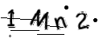

# gifCaptcha
> gif 图形验证码
# 丰富自定义设置
* 图片大小
* 多颜色
* 文字模式
* 文字数量
* 干扰强度
# 示例代码
````
package main

import (
    "github.com/zxbit2011/gifCaptcha"
    "image/color"
    "image/gif"
    "net/http"
)

var captcha = gifCaptcha.New()

func main() {
    //设置颜色
    captcha.SetFrontColor(color.Black, color.RGBA{255, 0, 0, 255}, color.RGBA{0, 0, 255, 255}, color.RGBA{0, 153, 0, 255})
    http.HandleFunc("/img", func(w http.ResponseWriter, r *http.Request) {
        gifData, code := captcha.RangCaptcha()
        println(code)
        gif.EncodeAll(w, gifData)
    })
    http.ListenAndServe(":8080", nil)
}
````
* 运行示例
> cd examples && go run main.go
* 浏览器预览

http://127.0.0.1:8080/img
# 示例效果
## 黑白

## 彩色


# 感谢
https://github.com/afocus/captcha
